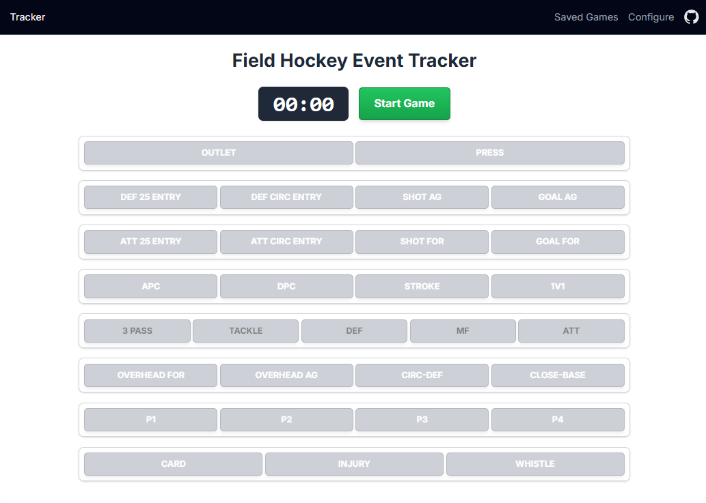
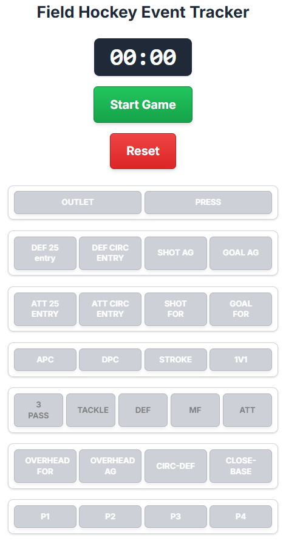
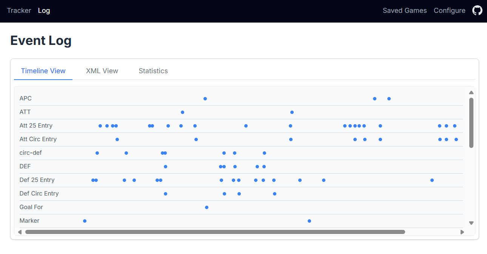
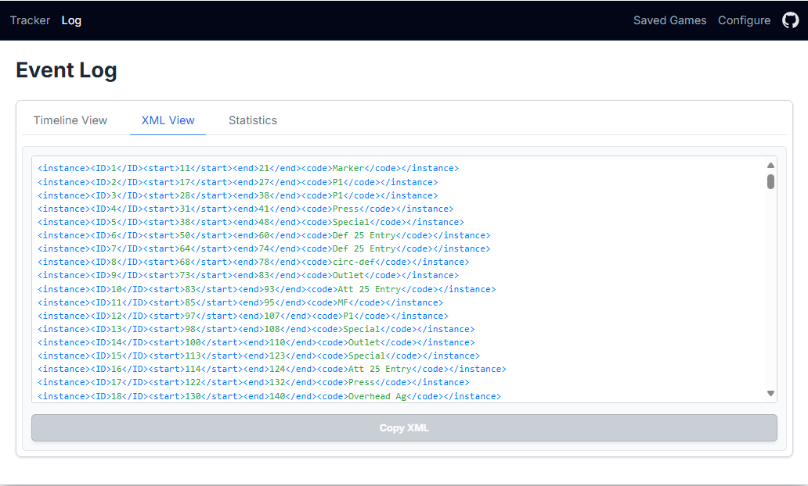
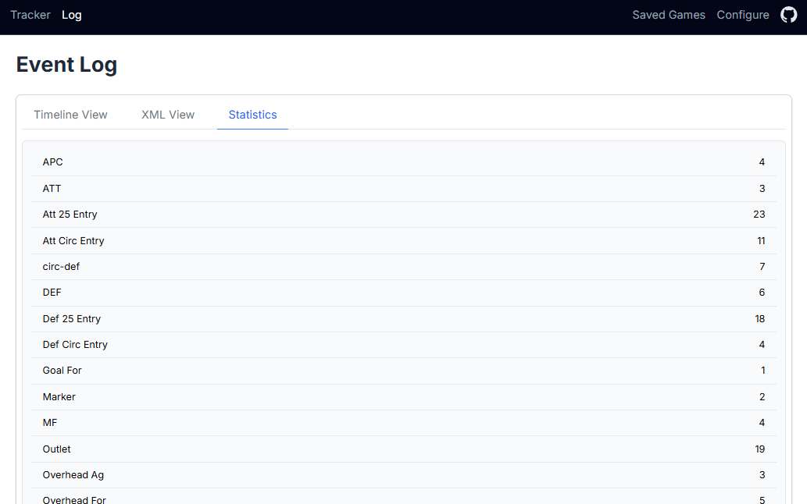

# Field Hockey Event Tracker

The **Field Hockey Event Tracker** is a web application designed to allow coaches, analysts, or enthusiasts to track specific actions (like goals, circle entries, tackles, etc.) during a game using a configurable button interface. Events are timestamped against a game timer. The application also features a timeline view that synchronizes these logged events with a locally loaded video file, allowing for quick navigation to key moments in the game footage.

## Running the Solution Locally

To run the solution locally, you can use the **Live Server** extension for Visual Studio Code. This extension provides a quick way to serve your project and view it in the browser.

### Steps to Install and Use Live Server

1. **Install the Live Server Extension**:
   - Open Visual Studio Code.
   - Go to the Extensions view by clicking on the Extensions icon in the Activity Bar on the side of the window or pressing `Ctrl+Shift+X`.
   - Search for "Live Server" in the Extensions Marketplace.
   - Click "Install" to add the extension to your Visual Studio Code.

2. **Open the Project**:
   - Open the `coding-tool` folder in Visual Studio Code.

3. **Start Live Server**:
   - Right-click on the `index.html` file in the Explorer view.
   - Select "Open with Live Server" from the context menu.

4. **View in Browser**:
   - Your default web browser will open, displaying the application.
   - Any changes you make to the files will automatically refresh the browser.

This method ensures a smooth local development experience without needing additional server setup.

## Features

### Game Timer

- Start, stop, and reset a game clock to track the elapsed time during a match.
- Log predefined or custom events with timestamps by clicking on configurable buttons.

### Customizable Configuration

- Customize the layout, labels, colors, and event names of the tracker buttons via a JSON configuration page.
- Save configurations directly in the browser's local storage for future use.

### Event Logs

- **List View**: Display a chronological list of logged events and their timestamps.
- **XML View**: View events formatted as XML, suitable for importing into other analysis tools. Includes a "Copy to Clipboard" function for easy sharing.

### Load Saved Games

- Load previously saved game logs from local storage to review past matches.
- Import game data from XML files for analysis.
- See the [Timeline View Guide](docs/timeline-view-guide.md) for detailed instructions on working with saved games.
- Clear the log to start a new game or remove old entries.

## Application Pages

### 1. Tracker Page

The Tracker page is the main interface for recording events during a game. It includes:

- A **timer** to track the elapsed game time.
- Buttons for recording predefined events, which can be customized in the Configure page.
- Options to start, pause, and reset the timer.

### 2. Configure Page

The Configure page allows users to customize the event buttons displayed on the Tracker page. Features include:

- A JSON editor to define button groups, labels, and colors.
- Options to save the configuration to local storage or load the default configuration.

### 3. Log Page

The Log page displays a detailed list of recorded events and provides options to export the log in XML format. Features include:

- A **Timeline View** for a timeline of events.
- An **XML View** for exporting events in XML format.
- A **Statistics View** to display the number of recorded events and their types. This helps users analyze the game's key moments at a glance.
- Options to copy the XML to the clipboard or clear the log.

### Timeline View

The Timeline View provides a visual representation of the events logged during the game. Each event is displayed as a marker on a timeline, synchronized with the game timer. You can also upload a video file and navigate to specific events by clicking on them in the timeline.

- [Timeline View Guide](docs/timeline-view-guide.md) - Detailed documentation on using the Timeline View feature
- Import and export game data using XML files
- Load saved games from local storage
- Interact with timeline events to navigate video footage

### XML View

The XML View allows users to export the logged events in XML format. This feature is useful for importing data into external analysis tools or sharing with others.

### Statistics View

The Statistics View displays a summary of the recorded events, including the total number of events and a breakdown by event type. This helps users analyze the game's key moments at a glance.

