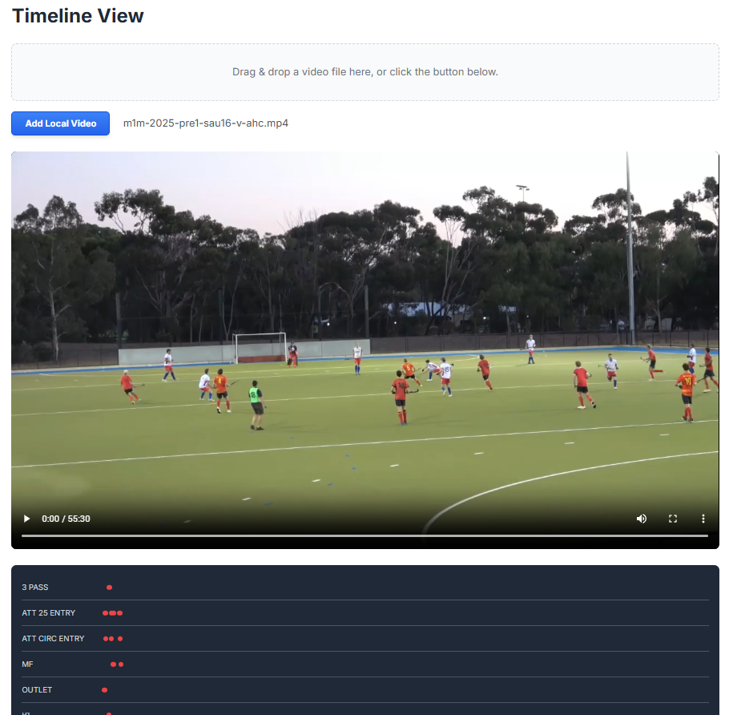

# Field Hockey Event Tracker

The **Field Hockey Event Tracker** is a web application designed to allow coaches, analysts, or enthusiasts to track specific actions (like goals, circle entries, tackles, etc.) during a game using a configurable button interface. Events are timestamped against a game timer. The application also features a timeline view that synchronizes these logged events with a locally loaded video file, allowing for quick navigation to key moments in the game footage.

## Features

### Game Timer

- Start, stop, and reset a game clock to track the elapsed time during a match.

### Event Logging

- Log predefined or custom events with timestamps by clicking on configurable buttons.

### Configurable Buttons

- Customize the layout, labels, colors, and event names of the tracker buttons via a JSON configuration page.
- Save configurations directly in the browser's local storage for future use.

### Event Log Views

- **List View**: Display a chronological list of logged events and their timestamps.
- **XML View**: View events formatted as XML, suitable for importing into other analysis tools. Includes a "Copy to Clipboard" function for easy sharing.

### Timeline View

- Load a local video file using drag-and-drop or file selection.
- Visualize logged events plotted on a timeline corresponding to the video duration.
- Click on event markers in the timeline to seek the video player to 5 seconds before the event occurred.

## How to Use

1. **Open**: Open the `index.html` (or the main HTML file) in your web browser.
2. **Configure (Optional)**: Navigate to the "Configure" page to modify the button layout using the JSON editor. Save the configuration.
3. **Track**: Navigate to the "Tracker" page. Click "Start Game" to begin the timer and log actions by clicking the event buttons.
4. **Review Log**: Navigate to the "Log" page to view events in either List or XML format. Use the "Copy XML" button if needed.
5. **Analyze Timeline**:
    - Navigate to the "Timeline" page.
    - Load a local video file using the "Add Local Video" button or by dragging the file onto the drop zone.
    - Once the video loads, the timeline will populate with logged events.
    - Click on event markers in the timeline to jump to the corresponding moment (event time - 5 seconds) in the video.

## Application Pages

### 1. Tracker Page

The Tracker page is the main interface for recording events during a game. It includes:

- A **timer** to track the elapsed game time.
- Buttons for recording predefined events, which can be customized in the Configure page.
- Options to start, pause, and reset the timer.

### 2. Configure Page

The Configure page allows users to customize the event buttons displayed on the Tracker page. Features include:

- A JSON editor to define button groups, labels, and colors.
- Options to save the configuration to local storage or load the default configuration.

### 3. Timeline Page

The Timeline page provides a visual representation of recorded events along with video playback. Features include:

- Drag-and-drop functionality to load a video file.
- A timeline view that maps events to specific timestamps in the video.
- Interactive markers to jump to specific moments in the video.

### 4. Log Page

The Log page displays a detailed list of recorded events and provides options to export the log in XML format. Features include:

- A **List View** for a chronological display of events.
- An **XML View** for exporting events in XML format.
- Options to copy the XML to the clipboard or clear the log.

## How to Use

1. Navigate to the **Tracker** page to start recording events.
2. Use the **Configure** page to customize the event buttons.
3. Load a video on the **Timeline** page to analyze events alongside video playback.
4. View and export recorded events on the **Log** page.

## Technologies Used

- **HTML** and **CSS** for the user interface.
- **JavaScript** for functionality and interactivity.
- **Tailwind CSS** for styling.

## Images

The images used in this README are located in the `images/` folder of the project.
