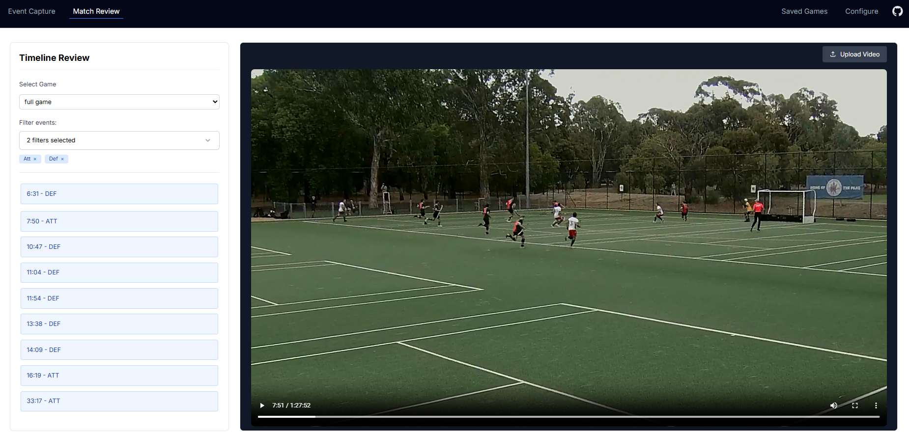

# Field Hockey Event Tracker

[](https://github.com/dneimke/simple-coding/actions/workflows/static.yml)
[](coverage/lcov-report/index.html)
[](https://www.ecma-international.org/ecma-262/6.0/)
[](https://opensource.org/licenses/MIT)

## Overview

The **Field Hockey Event Tracker** is a modern web application for coaches, analysts, and sports enthusiasts to record, analyze, and visualize game events in real-time. Built with HTML5, Tailwind CSS, and modern Vanilla JavaScript (ES6+), it offers a responsive interface for sports performance analysis without requiring a server connection.


## Table of Contents

- [Features](#features)
- [Application Structure](#application-structure)
- [Getting Started](#getting-started)
- [Documentation](#documentation)
- [License & Acknowledgments](#license--acknowledgments)

## Features

### Core Capabilities

- **Real-time Event Recording**: Capture timestamped events during live games with minimal friction
- **Customizable Interface**: Configure event buttons to match your team's specific tracking needs
- **Multiple Analysis Views**: Review events as lists, timelines, or aggregated statistics
- **Video Synchronization**: Link recorded events with video footage for in-depth analysis
- **Data Portability**: Export data in XML format for compatibility with other analysis tools
- **Offline Functionality**: Works without internet connection, storing data in browser local storage

### Game Management

- **Timer Controls**: Start, stop, and reset a game clock to track elapsed match time
- **Event Logging**: Record events with timestamps using customizable buttons
- **Data Persistence**: Automatically save games to prevent data loss
- **History Access**: Load previously recorded games from browser storage

## Application Structure

The application is organized into four main interfaces:

### 1. Event Capture Page

The primary interface for recording live game events with:

- Game timer controls
- Customizable event buttons
- Quick action tools (undo, reset)
- Real-time feedback when events are recorded


### 2. Match Review Page

For analyzing recorded events with video synchronization:

- Timeline view of all events
- Video player synchronized with event timestamps
- Navigation between significant game moments



### 3. Configure Page

Customize the application to match specific tracking needs:

- JSON editor for button configuration
- Save/load multiple layouts
- Preview changes before applying

### 4. Log Page with Multiple Views

Review and export recorded game data in various formats:

**Timeline View**:

- Visual representation of events along a time axis
- Video synchronization capabilities


**XML View**:

- Structured data export for integration with external tools
- Copy-to-clipboard functionality


**Statistics View**:

- Aggregate metrics and event distribution
- Quick insights into game patterns


## Getting Started

### Installation

```bash
# Clone the repository
git clone https://github.com/your-username/field-hockey-event-tracker.git

# Navigate to project directory
cd field-hockey-event-tracker

# Install dependencies
npm install
```

### Running Locally

```bash
# Start development server
npm start
```

### Testing

```bash
# Run tests
npm test

# Generate coverage report
npm run test:coverage
```

## Documentation

Additional documentation is available in the `docs/` directory:

- [Match Review](docs/match-review.md) - Video synchronization features
- [Saved Games](docs/saved-games.md) - Game data storage architecture
- [State Management](docs/state-management.md) - Application state design
- [User Workflow](docs/user-workflow.md) - Current user experience
- [Developer Guide](docs/developer-guide.md) - Contributing guidelines

## License & Acknowledgments

This project is licensed under the MIT License - see the LICENSE file for details.

**Acknowledgments**:

- Developed for field hockey coaches and analysts
- Inspired by the needs of sports performance analysis
- Thanks to all contributors and testers for their valuable feedback
