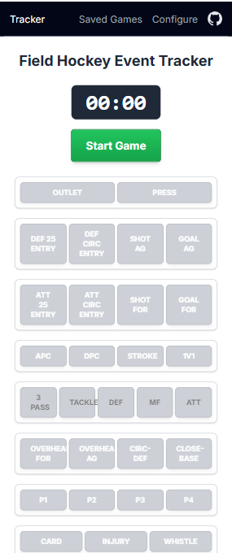

# Field Hockey Event Tracker

## Overview

The **Field Hockey Event Tracker** is a modern web application that empowers coaches, analysts, and sports enthusiasts to record, analyze, and visualize game events in real-time. Built with HTML5, Tailwind CSS, and modern Vanilla JavaScript (ES6+), it offers a responsive and customizable interface for sports performance analysis.

Key features:

- Record timestamped events during live games with minimal friction
- Customize event buttons to match your team's specific tracking needs
- Review event logs in multiple formats (list, timeline, statistics)
- Sync recorded events with video footage for in-depth analysis
- Export data in XML format for compatibility with other analysis tools
- Persist games and configurations with browser local storage
- Works offline with no server dependencies

## Table of Contents

- [Getting Started](#getting-started)
  - [Installation](#installation)
  - [Running Locally](#running-locally)
  - [Testing](#testing)
- [Features](#features)
- [Application Pages](#application-pages)
- [Technical Architecture](#technical-architecture)
- [Contributing](#contributing)
- [Project Documentation](#project-documentation)

## Features

### Game Timer and Event Recording

- **Real-time Timer**: Start, stop, and reset a game clock to track elapsed match time
- **Event Logging**: Record predefined events with timestamps using customizable buttons
- **Quick Actions**: Ability to undo or modify recent events

### Customizable Configuration

- **Button Editor**: Customize event buttons via an intuitive JSON configuration interface
- **Preset Layouts**: Create and save multiple button configurations for different analysis needs
- **Local Storage**: Configurations persist between sessions in your browser's storage

### Data Management

- **Game Saving**: Automatically save games to prevent data loss
- **Import/Export**: Exchange game data with other analysis tools via XML format
- **Local Storage**: Access previously recorded games from your browser's storage
- **Data Clearing**: Option to start fresh with a new game recording

### Analysis Views

- **List View**: Chronological list of events with timestamps and details
- **Timeline View**: Visual representation of events with video synchronization
- **Statistics View**: Aggregated counts and metrics from recorded events
- **XML View**: Raw data export with copy-to-clipboard functionality

## Application Pages

### Event Capture Page

The primary interface for recording live game events:

- **Game Timer**: Controls for starting, pausing, and resetting the game clock
- **Event Buttons**: Customizable buttons for logging different event types
- **Quick Actions**: Undo functionality and game management options
- **Real-time Feedback**: Visual confirmations when events are recorded

### Match Review Page

The interface for reviewing match events synchronized with video footage:

- **Timeline Panel**: Chronological view of all recorded match events with filtering
- **Video Player**: Video playback control synced with game events
- **Event Navigation**: Click on events to jump to specific moments in the video
- **Game Selection**: Choose from previously recorded games to review

### Configure Page

Customize the application to match your specific tracking needs:

- **JSON Editor**: Define event button groups, labels, colors, and behaviors
- **Configuration Management**: Save, load, and reset button layouts
- **Preview**: See your changes before applying them to the Event Capture page
- **Persistence**: All configurations are saved to browser local storage

### Log Page

Review, analyze, and export recorded game data:

- **Event List**: Chronological list of all recorded events with timestamps
- **Export Options**: Save or share your data in various formats
- **Game Selection**: Load previous games from local storage
- **Data Management**: Clear logs or start new recordings

The Log Page includes multiple views:

#### Timeline View

Visual representation of game events with video synchronization:

- Markers for each event positioned along a time axis
- Video playback controls synced with event timestamps
- Click navigation to jump to specific events in the footage
- [Timeline View Guide](docs/timeline-view-guide.md) for detailed usage instructions

#### XML View

Raw data export for integration with external analysis tools:

- Structured XML format containing all event data
- Copy-to-clipboard functionality for easy sharing
- Compatible with third-party sports analysis platforms

#### Statistics View

Aggregate metrics and counts of recorded events:

- Total events by category and subcategory
- Visual representation of event distribution
- Quick insights into game patterns and key moments

## Project Documentation

Additional documentation is available in the `docs/` directory:

- [Match Review](docs/match-review.md) - Documentation for the match review timeline video feature
- [Saved Games](docs/saved-games.md) - Architecture for game data storage and retrieval
- [State Management](docs/state-management.md) - Overview of the application state architecture
- [User Workflow](docs/user-workflow.md) - Current user experience and workflow for the game tracker
- [Developer Guide](docs/developer-guide.md) - Guidelines for developers contributing to the project

## License

This project is licensed under the MIT License - see the LICENSE file for details.

## Acknowledgments

- Developed for field hockey coaches and analysts
- Inspired by the needs of sports performance analysis
- Thanks to all contributors and testers who have provided valuable feedback
