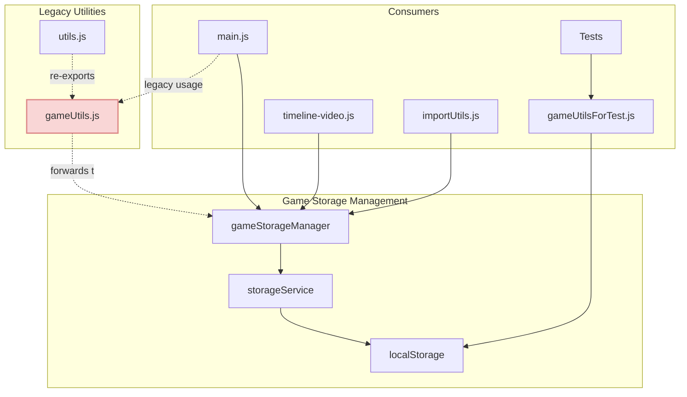

# Saved Games Architecture Documentation

## Architecture Overview

The functionality for managing saved games is distributed across multiple files in the project. The codebase shows an architectural migration from simple utility functions to a more structured, object-oriented approach with `gameStorageManager`.



## Storage Components

### [`src/services/gameStorageManager.js`](../src/services/gameStorageManager.js)

This is the primary class responsible for managing game storage operations:

- **`getAllGames()`**: Retrieves all saved games from localStorage
- **`getGameByIndex()`**: Gets a specific game by its index
- **`updateGame()`**: Updates a saved game with new data
- **`removeGame()`**: Removes a game from storage
- **`saveGame()`**: Saves a new game to storage

The class uses a singleton pattern with an instance exported as `gameStorageManager`.

### [`src/services/storageService.js`](../src/services/storageService.js)

This is a lower-level service that directly interacts with the browser's localStorage:

- **`getItem()`**: Retrieves and parses data from localStorage
- **`setItem()`**: Stores data in localStorage, handling errors

## Legacy Utilities (Deprecated)

### [`src/utils/gameUtils.js`](../src/utils/gameUtils.js)

This file contains previously used utility functions that are now deprecated in favor of the `gameStorageManager`:

- **`saveGameToLocalStorage()`**: ⚠️ DEPRECATED - Now forwards to `gameStorageManager.saveGame()`
- **`loadSavedGames()`**: ⚠️ DEPRECATED - Now forwards to `gameStorageManager.getAllGames()`
- **`updateSavedGame()`**: ⚠️ DEPRECATED - Now forwards to `gameStorageManager.updateGame()`
- **`deleteSavedGame()`**: ⚠️ DEPRECATED - Now forwards to `gameStorageManager.removeGame()`

These functions include deprecation warnings and forward calls to the corresponding methods in `gameStorageManager`.

Non-storage related functions remain in this file:

- **`computeGameStatistics()`**: Calculates statistics from game data
- **`createGameCard()`**: Creates UI cards for saved games
- **`loadConfig()`**: Loads configuration data
- **`saveConfig()`**: Saves configuration data

### [`src/utils/utils.js`](../src/utils/utils.js)

This file re-exports the deprecated functions from `gameUtils.js` with warning comments:

```javascript
// The functions below are deprecated - use gameStorageManager instead
saveGameToLocalStorage, // ⚠️ Deprecated: Use gameStorageManager.saveGame()
loadSavedGames,         // ⚠️ Deprecated: Use gameStorageManager.getAllGames()
deleteSavedGame,        // ⚠️ Deprecated: Use gameStorageManager.removeGame()
updateSavedGame         // ⚠️ Deprecated: Use gameStorageManager.updateGame()
```

### [`src/utils/gameUtilsForTest.js`](../src/utils/gameUtilsForTest.js)

A simplified version of game utility functions used for testing purposes.

## Consumer Usage Analysis

### [`src/main.js`](../src/main.js)

The main application file contains the `renderSavedGames()` function which:

1. Gets all saved games using `gameStorageManager.getAllGames()`
2. Creates UI cards for each game with load/rename/delete actions
3. Sets up an `onLoad` handler for each game that:
   - Checks for an active game and prompts for confirmation
   - Uses `gameState.setGameState()` to restore the saved game state
   - Updates the UI elements appropriately
   - Shows a success message

### [`src/js/timeline-video.js`](../src/js/timeline-video.js)

This file contains timeline-specific game loading functionality:

- **`getSavedGames()`**: Gets saved games from localStorage
- **`loadGame(gameId)`**: Loads a specific game by ID and updates the timeline view

## Flow of Loading a Saved Game

1. The user navigates to the saved games view
2. The `renderSavedGames()` function in `main.js` fetches all saved games using `gameStorageManager.getAllGames()`
3. For each game, a card is created with an `onLoad` handler
4. When the user clicks to load a game:
   - The handler checks if there's an active game and asks for confirmation
   - It then updates the application state with the saved game data using `gameState.setGameState()`

## Migration Status

The codebase is currently in a transition phase:

1. **Current State**: The `gameStorageManager` class is the primary storage mechanism, with legacy functions now forwarding to it.

2. **Consumers**:
   - Some files like `main.js` have been updated to use `gameStorageManager` directly
   - Legacy code paths may still use the old utility functions, which now forward to `gameStorageManager`

3. **Next Steps**:
   - Replace all direct usages of the deprecated utility functions with `gameStorageManager` calls
   - Once all consumers have been migrated, the deprecated functions can be safely removed
   - Update tests to use `gameStorageManager` instead of `gameUtilsForTest.js`

4. **Completion Timeline**: The migration should be completed by the next major release to ensure consistency across the codebase.
   - The UI is updated to reflect the loaded game

In the timeline view (timeline-video.js), a separate `loadGame()` function is used that:

1. Gets the saved games using `getSavedGames()`
2. Loads the specific game by ID
3. Updates the timeline events and renders the timeline

## Storage Keys

Both implementations use the same storage key: `fieldHockeyGames_v1` - this ensures compatibility between different parts of the application.
