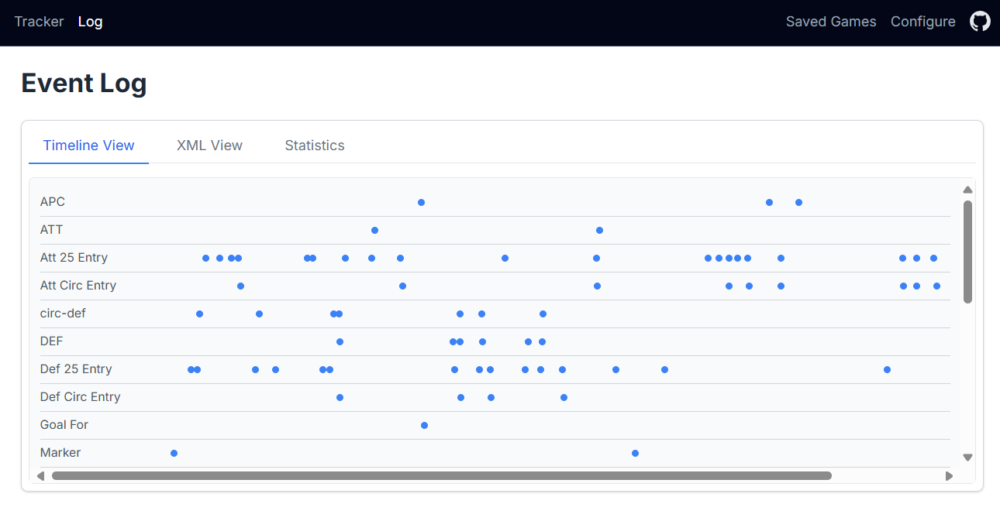

# Timeline View Guide

## Overview

The Timeline View is a feature that allows you to review and navigate events during a sports game. It provides a chronological display of game events alongside a video player, making it easy to correlate events with video footage.

## Getting Started

### Accessing the Timeline View

The Timeline View can be accessed from the main tracker by clicking on the "Timeline & Video View" link or by navigating directly to the timeline-video.html page.

### Loading Game Data

Before you can view timeline events, you need to load game data. There are three ways to load game data:

1. **Select a Saved Game**: Choose a previously saved game from the dropdown menu.
2. **Import XML Data**: Import game data from an XML file by clicking the "Import XML" button.
3. **Load Sample Data**: Click the "Load Sample" button to load example game data for testing.



## Working with Timeline Events

Once game data is loaded, the timeline will display events chronologically (newest first). Each event shows:

- **Time**: When the event occurred
- **Title**: Brief description of the event (e.g., "Goal Scored")
- **Description**: Additional details about the event

### Interacting with Events

You can click on any event in the timeline to seek the video player to the corresponding moment in the game. This allows you to quickly jump to important moments without manually searching through the video.

#### Event Sorting Behavior

Timeline events are automatically sorted in reverse chronological order (newest first), making it easy to see the most recent events at the top of the timeline. This sorting behavior is particularly useful during live game tracking, as new events will appear at the top of the list.

#### Video Seeking Mechanism

When you click on an event, the application:

1. Calculates the time difference between the clicked event and the first event in the game
2. Converts this time difference to seconds
3. Seeks the video player to that position
4. The video will automatically jump to the moment of the event (assuming the video timeline corresponds to the game timeline)

## Video Playback

### Uploading a Video

To associate a video with your timeline:

1. Click the "Upload Video" button in the upper right of the video area
2. Select a video file from your device
3. The video will begin loading immediately

### Video Controls

Standard video controls are available:

- Play/Pause
- Volume control
- Timeline scrubbing
- Full-screen toggle

The current video time is displayed above the timeline events for reference.

## XML Data Format

The timeline view supports importing game data from XML files. The format is as follows:

```xml
<?xml version="1.0" encoding="UTF-8"?>
<game date="YYYY-MM-DD" teams="Team A vs Team B" location="Location Name">
  <events>
    <event timestamp="YYYY-MM-DDThh:mm:ssZ" title="Event Title" description="Event Description" />
    <!-- Additional events... -->
  </events>
</game>
```

### Required XML Elements

- `<game>`: Root element containing game metadata
- `<events>`: Container for all game events
- `<event>`: Individual event with the following attributes:
  - `timestamp`: Date and time of the event in ISO format (YYYY-MM-DDThh:mm:ssZ)
  - `title`: Short event name
  - `description`: Detailed event description

You can download a [sample XML file](../assets/sample-game.xml) to use as a template.

## Saving and Managing Games

When you import XML data or load sample data, the game is automatically saved to your browser's local storage using a versioned storage key (`fieldHockeyGames_v1`). This allows the application to evolve over time while maintaining backward compatibility with saved data. You can access saved games later by selecting them from the "Select Saved Game" dropdown.

## Accessibility Features

The Timeline View includes the following accessibility features:

- Keyboard navigation for timeline events
- Screen reader compatibility
- Clear visual indicators for selected events
- Proper semantic HTML structure

## Tips for Effective Use

1. **Organize Events Chronologically**: Events are displayed newest-first to make recent events easily accessible.
2. **Use Descriptive Titles**: Make event titles clear and consistent for easier scanning.
3. **Include Detailed Descriptions**: Add player numbers, specific actions, and other relevant details in the description.
4. **Prepare Video Files in Advance**: Convert video files to web-compatible formats (MP4, WebM) for best results.

## Troubleshooting

### Common Issues

| Issue | Possible Solution |
|-------|-------------------|
| No saved games appear in the dropdown | Check if your browser has local storage enabled |
| XML file fails to import | Ensure your XML follows the format specified above |
| Video and timeline events don't sync | Verify that video length matches the timespan between first and last event |
| Video doesn't play | Check that your browser supports the video format (MP4, WebM, etc.) |
| Timeline events don't appear | Ensure you've selected a game or imported data before looking for events |

### Local Storage Limitations

The application uses your browser's local storage to save game data. Be aware that:

- Local storage has size limitations (typically 5-10MB per domain)
- Clearing browser data will remove saved games
- Data is stored only on the current device and isn't synchronized across devices

## For Developers

### Technical Implementation

The Timeline View is implemented using vanilla JavaScript, HTML, and Tailwind CSS. Key files include:

- **timeline-video.js**: Main controller file that handles game loading, XML parsing, and UI interaction
- **timeline.js**: Contains the core functionality for rendering timeline events
- **timeline-video.html**: The HTML structure for the Timeline View interface

### Event System

The application uses a custom event system to facilitate communication between components:

```javascript
// When a timeline event is clicked, a custom event is dispatched
const timelineClickEvent = new CustomEvent('timeline-event-clicked', {
  detail: {
    title: event.title,
    timestamp: event.timestamp,
    description: event.description,
    seekTime: timestampInSeconds
  }
});
document.dispatchEvent(timelineClickEvent);
```

### Extending Functionality

To extend the Timeline View, consider these integration points:

1. **Add new event types**: Extend the XML format and update the parser
2. **Improve video synchronization**: Enhance the video seeking mechanism
3. **Add data export capabilities**: Create functions to export game data as XML or JSON
4. **Implement cloud storage**: Add authentication and remote storage capabilities

## Integration with Field Hockey Tracker

The Timeline View is designed to work seamlessly with the main Field Hockey Event Tracker application. Here's how they integrate:

### Workflow Integration

1. **Capture events during a live game** using the main tracker interface
2. **Review and analyze events** using the Timeline View
3. **Navigate video footage** by clicking on timeline events
4. **Export events** for sharing or archiving

### Data Flow

Events captured in the main tracker flow into the same localStorage system used by the Timeline View, ensuring that all game data is accessible from both interfaces. This unified data approach allows for a seamless experience when switching between live tracking and video analysis.
